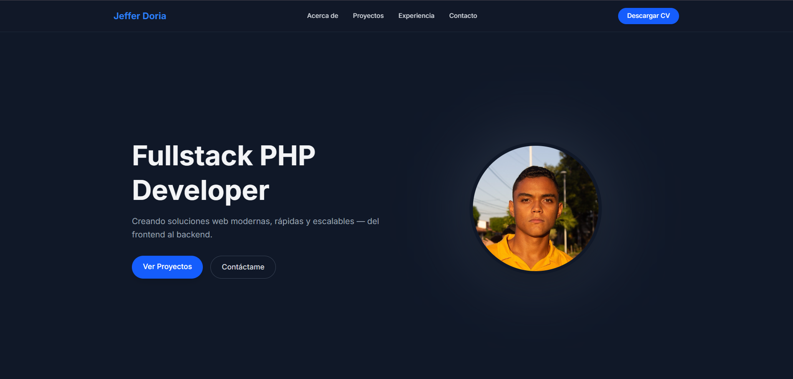

# Jeffer Doria – Fullstack PHP Developer

> **Aplicaciones web modernas, rápidas y escalables — del frontend al backend.**

---

## Tecnologías

| Área | Herramientas |
|------|--------------|
| **Backend** | PHP 8+, Laravel 11, Livewire, Blade |
| **Frontend** | Tailwind CSS, Alpine.js, AOS (animaciones) |
| **Base de datos** | MySQL |
| **Herramientas** | Git, Composer, XAMPP, VS Code |
| **Email** | Gmail SMTP (envío transaccional) |

---

## Características del Portafolio

- **Diseño 100% responsive** (móviles, tablets, desktop)
- **Animaciones suaves** con AOS
- **Formulario de contacto con AJAX**  
  → Sin recargar página  
  → Modal de éxito  
  → Validación en tiempo real  
  → Envío por Gmail SMTP
- **Código limpio y bien estructurado**
- **Optimizado para SEO y velocidad**

---

## Estructura del Proyecto
